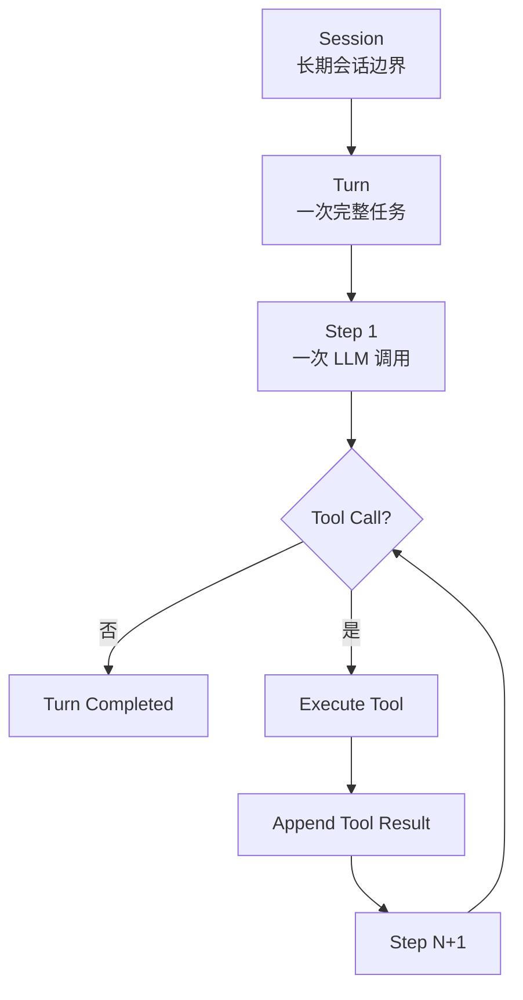

# Kolyan Agent 执行模型

本文件只描述 Agent Kernel 的执行模型。仓库整体结构、模块职责和多语言边界分别见：

- [模块地图](module-map.md)
- [多语言边界](multi-language-boundary.md)
- [开发路线](development-roadmap.md)

## 目标

Kolyan 的最小执行单元是：

```text
输入
  → LLM
  → Tool Call（可选）
  → Tool Result
  → 再次调用 LLM
  → 结束状态
```

第一阶段不引入完整 Session Runtime、事件总线、持久化 Ledger、MCP、Plugin 或多 Agent 编排。仓库目录会提前预留这些边界，但实现按开发路线逐步加入。

## 三层抽象



### Session

`Session` 表示长期存在的会话上下文。它未来可以拥有：

- Session ID；
- 历史消息；
- 模型和工具配置；
- resume / fork / replay；
- 持久化和事件记录。

当前阶段只保留它作为上层边界，不实现 Session 存储和恢复。

### Turn

`Turn` 表示一次用户输入触发的完整 Agent 执行。一个 Turn 可以包含多个 Step：

```text
Turn
  ├── Step 1：分析并请求搜索工具
  ├── Tool Result：搜索结果
  ├── Step 2：分析并请求编辑工具
  ├── Tool Result：编辑结果
  └── Step 3：生成最终回答
```

Turn 负责：

- 保存本轮内存中的消息列表；
- 控制最大 Step 数；
- 调用 LLM；
- 分发 Tool Call；
- 将 Tool Result 追加回上下文；
- 判断最终结束状态。

Turn 不负责：

- 长期 Session 持久化；
- UI 事件总线；
- MCP / Plugin 生命周期；
- 多 Agent 调度。

### Step

`Step` 表示一次 LLM 请求和响应处理。一个 Step 包含：

```text
Context Snapshot
  → LLM Request
  → Model Response / Stream
  → Tool Calls
```

Step 可以记录：

- step index；
- 输入消息数量；
- 模型响应；
- Tool Calls；
- finish reason；
- token usage。

Step 不执行工具或回填 Tool Results，也不决定长期会话或直接实现 Session 恢复。

当前 Turn 的普通执行、审批挂起和恢复共用一个内核循环。外部取消通过
`TurnBoundaryControl::admit` 在模型、工具、审批和完成边界接入；
`TurnControl` 提供当前执行的快速中断。运行实例的身份和持久化由 Runtime
负责，不改变 Session / Turn / Step 三层抽象。完整契约见
[0016](../requirements/0016-turn-boundary-and-resume.md)。

## 概念示例（非当前 API）

```rust
struct Turn {
    messages: Vec<Message>,
    max_steps: usize,
}

struct Step {
    index: usize,
    response: ModelResponse,
}

trait Llm {
    async fn complete(
        &self,
        messages: &[Message],
    ) -> Result<ModelResponse>;
}

trait Tools {
    async fn execute(
        &self,
        call: ToolCall,
    ) -> ToolResult;
}
```

当前实现以 Provider/Step 事件流为基础，再聚合出完整响应；下面仅表达二者关系，不是后续才实现流的计划：

```text
complete(messages)
  → stream(messages)
  → aggregate Model Events
  → ModelResponse
```

## Turn 主循环

Turn 的正式需求契约见 [Turn 执行模型](../requirements/0004-turn-execution.md)。以下伪代码描述目标循环，V0 已使用受限的 `shell.query` 工具验证一次真实的多 Step 闭环。

```rust
async fn run_turn(
    mut turn: Turn,
    llm: &dyn Llm,
    tools: &dyn Tools,
) -> RunResult {
    for index in 0..turn.max_steps {
        let response = llm
            .complete(&turn.messages)
            .await?;

        let step = Step {
            index,
            response: response.clone(),
        };

        turn.messages.push(response.message);

        if step.response.tool_calls.is_empty() {
            return RunResult::Completed(
                step.response.text(),
            );
        }

        for call in step.response.tool_calls {
            let result = tools.execute(call).await;
            turn.messages.push(
                Message::tool_result(result),
            );
        }
    }

    RunResult::MaxSteps
}
```

## 结束状态

第一阶段只需要有限的结果类型：

```rust
enum RunResult {
    Completed(String),
    MaxSteps,
    Cancelled,
    Failed(String),
}
```

## 演进顺序

```text
V0  Turn + Step + in-memory messages
V1  Model Stream + incremental output
V2  Tool validation / authorization
V3  Session store + resume / replay
V4  explicit state machine + events
V5  Subagent / supervisor / multi-agent
```

核心原则：

> 先保持 Turn 内核足够小；Session 是稳定的上层边界，只有在需要恢复、持久化或跨任务历史时才实现它。
